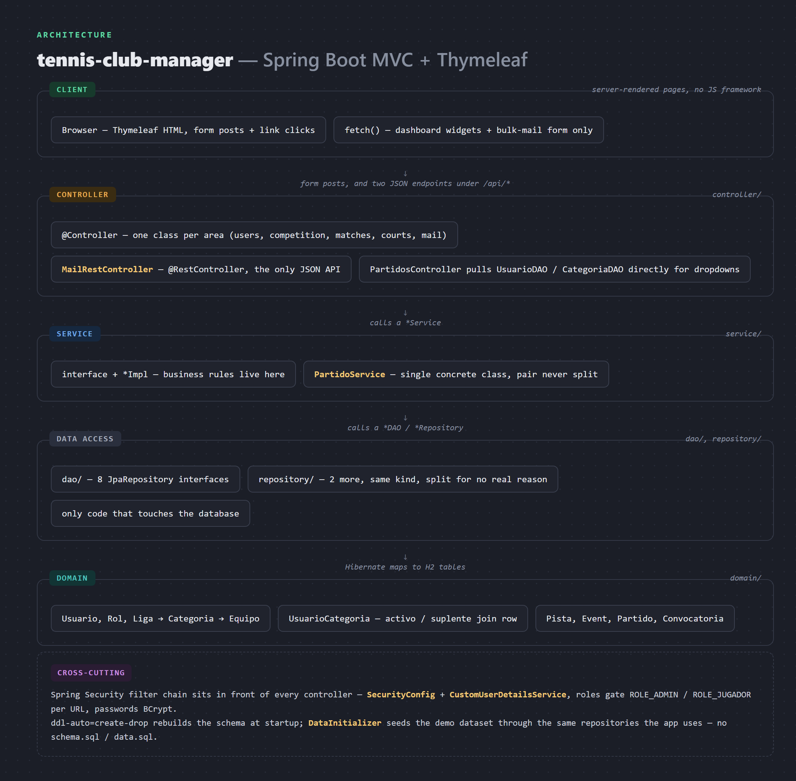
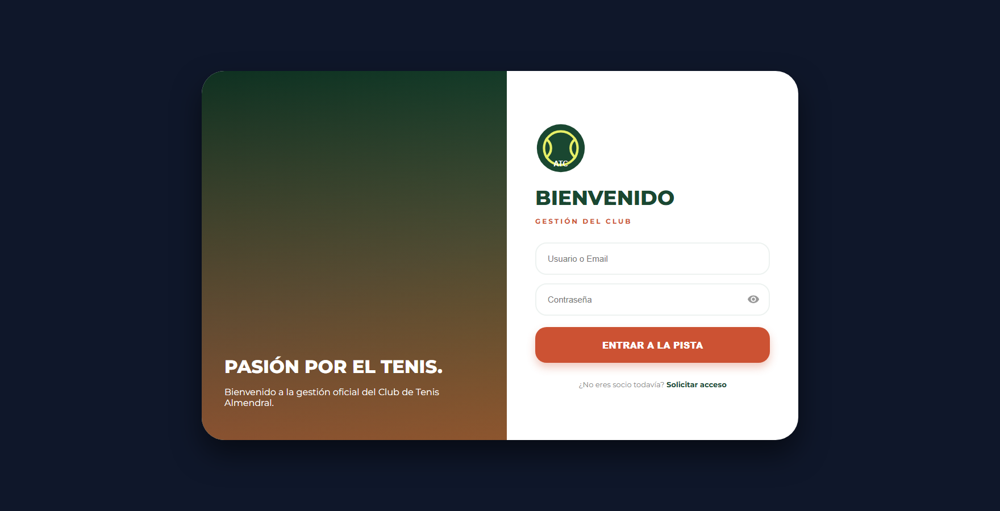
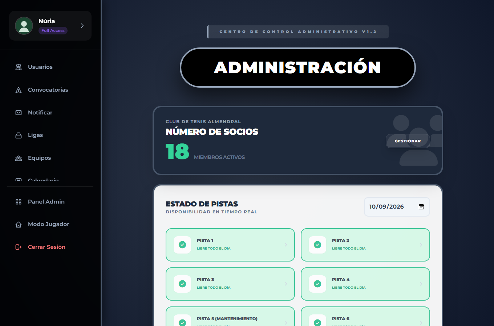
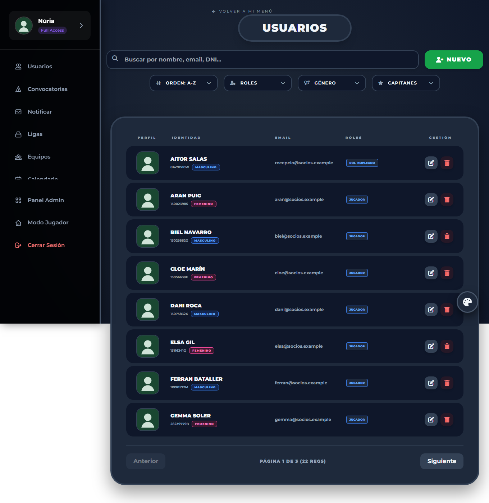
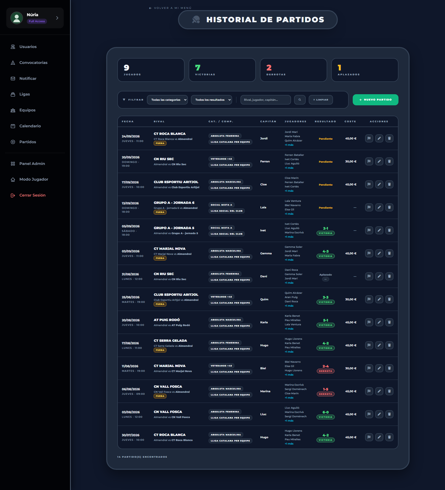
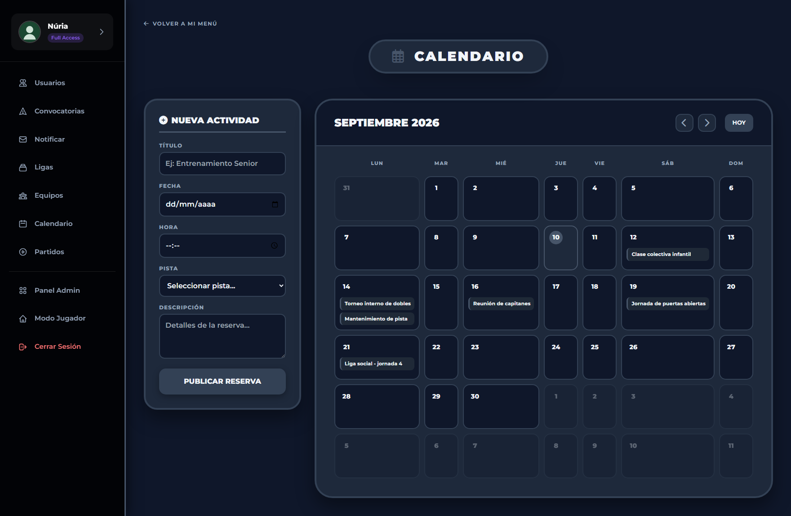
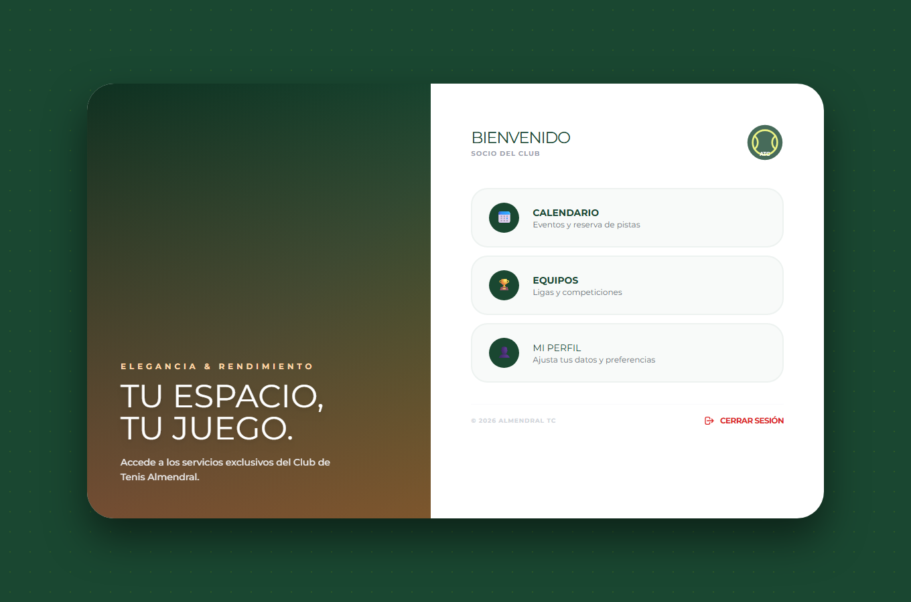

# tennis-club-manager


Back-office web app for a tennis club. An administrator manages the membership — players,
staff, other admins — and the competition structure underneath it: leagues, the categories
inside each league, and the team registered per category. There is a booking calendar for
the six courts, a match history with the score and cost of each fixture, and an
announcements screen that goes out to everyone or to one category. Players get a smaller
view: their profile, the shared calendar, the teams they belong to.

It is a team project from the second year of the DAM programme. The stack is Spring Boot
with server-rendered Thymeleaf views, Spring Security for the login and the role split, and
JPA over an H2 database that lives in memory. Contributors are listed at the bottom.

## Start here

The clearest single file is
[`PartidoService`](src/main/java/Tennis_ERP/TennisErp/service/PartidoService.java) — the
fixture lifecycle. A match is created as `pending` with a squad and an optional captain;
`registrarResultado` is the quick action that sets `win` / `lost` / `postponed` and a score,
while `actualizar` is the full edit and applies each field only if the form actually sent it.
The "played" count on the admin home is deliberately `win + lost`, so postponed and pending
fixtures do not inflate it. The other thing worth a look is the role split: everything under
[`springsecurity/`](src/main/java/Tennis_ERP/TennisErp/springsecurity/), plus
`PistaOcupacionDTO` and `MailRestController` — the only JSON the app serves, behind the
court-occupancy widget and the announcement recipient preview. Every other screen is
full-page Thymeleaf.

## Running it

You need a JDK 21. Nothing else — no database to install, no configuration file to fill in.

```
git clone https://github.com/PresidenteOG/tennis-club-manager.git
cd tennis-club-manager
./mvnw spring-boot:run
```

Open <http://localhost:8086> and sign in. Every demo account has its password equal to its
username; the two that matter are:

| Username | Password | Sees |
|---|---|---|
| `admin` | `admin` | the full back office |
| `jugador` | `jugador` | the player view |

The database is rebuilt and re-seeded on every start, so you always land on the same
populated club: 22 members, 2 leagues, 5 categories, 4 teams, 6 courts, 14 matches across
won / lost / postponed / pending, 5 announcements and a handful of calendar entries. The
data is invented — see [Where the data comes from](#where-the-data-comes-from). Changes you
make through the UI stay until the next restart.

The H2 console is at <http://localhost:8086/h2-console> (JDBC URL `jdbc:h2:mem:tennisdb`,
user `sa`, no password).

## Runs offline

Nothing in the app talks to the network at runtime.

- **Database.** The original used MySQL. This build uses an in-memory H2 that Hibernate
  creates on startup; `DataInitializer` fills it.
- **Email.** The announcement screens used to send over an external SMTP account (`GMAIL_API`). Now `EmailServiceImpl`
  writes each message as an `.html` file into `./outbox/` and logs one line per recipient.
  The screens work exactly the same; open the files to see what would have been sent.
- **Front-end assets.** Tailwind, Font Awesome, the Montserrat font and Bootstrap are
  vendored under `src/main/resources/static/vendor/`. Avatars with no uploaded image fall
  back to a local SVG instead of an avatar-generator service.

## Where the data comes from

The club in the demo does not exist. Members, their DNIs and phone numbers, the rival club
names, the scores, the announcements — all made up in `DataInitializer`, none of it carried
over from the real club the original project was built for. Uploaded member photos are not
seeded; the app shows a placeholder avatar until you add one, and any upload lands in a
gitignored `uploads/` folder.

## Layout

```
controller/      request handling, one controller per area (users, competition, matches, courts, mail)
service/         business logic behind interfaces, *Impl classes hold it
dao/ repository/  Spring Data JPA interfaces, the only place that touches the database
domain/          the 10 JPA entities
dto/             one projection used by the court-occupancy endpoint
springsecurity/  the filter chain, the UserDetailsService, the resource handler for uploads
```



More detail, and how a request actually crosses those layers, is in [ARCHITECTURE.md](ARCHITECTURE.md).

## Screenshots

From a local run on the seeded club.

 | 
:---:|:---:
Login | Admin home

 | 
:---:|:---:
Members | Match history

 | 
:---:|:---:
Calendar | Player view (`jugador` / `jugador`)

## License

[PolyForm Noncommercial 1.0.0](LICENSE). Personal and non-commercial use only — it is a
learning project, not something to run a real club on.

## Contributors

Built by three students on the DAM course:

- **Daniel Adanegbe** ([@PresidenteOG](https://github.com/PresidenteOG)) — REST endpoints, UI design, domain logic, the Docker setup
- **Baye** ([@ass241](https://github.com/ass241)) — bug fixing, seed data, SQL
- **Andrés** ([@Andre03uwu](https://github.com/Andre03uwu)) — API work, error handling, content

The `jfern264/GestionCTT` repository it came from was the course tutor's; this is a clean
single-commit copy under Daniel's account with the real club's data removed.
